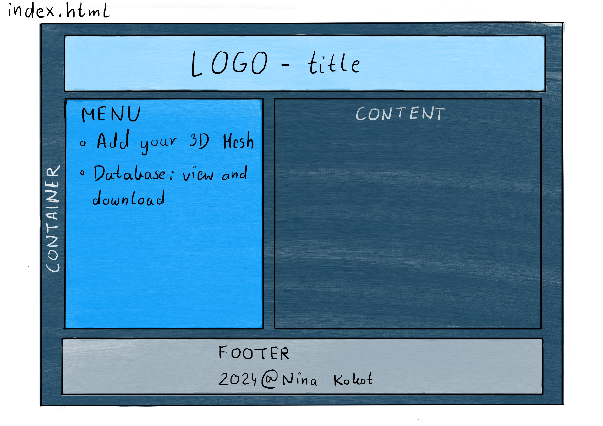

## Nina Kokot

# Web based asset database

## Overview

   This is a web based asset database that allows the user to upload a 3D models onto the website and into a database that can later be viewed and downloaded.

   For that I used SQlite, Flask and web dev such as html and css.

   Files will be stored inside of a project folder called mesh.

## Requirements

   * Flask==3.0.3
   * Flask-SQLAlchemy==3.1.1
   * numpy==1.26.3
   * SQLAlchemy==2.0.29

## Deployment

   1. Clone repo: 

   ```
   git clone git@github.com:NCCA/msccavepipelineandtdproject24-Nonanike.git
   ```

   2. Run 

   ```
   pip install -r requirements.txt
   ```

   3. Run

   ```
   python app.py
   ```

   4. Copy this address and enter it into a browser

   ```
   http://127.0.0.1:5000
   ```
   or

   simply click 
   ##### CTRL + left mouse click 
   on the that link from above to open it automatically in a browser.

## User instructions

   1. To upload 3D model:

      * Click on 'Add your 3D Mesh' on the left side bar

      * Choose a file you want to add to the database. Important: you can only upload 'obj', 'fbx' or 'usd'

      * ##### If you want to test the app first, there is a folder named 'testMesh' in the root directory with some 3D mesh examples to use

      * #### Enter the exact same name of your file in the 'Name of your model' space as your original file's name - otherwise it won't allow you to download it later (for example: Cube.obj - Name of your model: Cube)

      * #### Enter the accurate type of your file - obj, fbx or usd (for example: Cube.obj - Type: obj)

      * Add author, description and the date if you wish it to be added to the database

      * Clik 'Submit'

   2. To view the database and download any 3D meshes:

      * Click on 'Database: view and download' on the left side bar

      * Choose a file you want to download and click 'Download'

### Project structure

      /web_based_asset_database 
         /app.py 
         /requirements.txt    
         /mesh 
         /scripts
            /addToDataBase.py
            /CreateDatabase.sql
         /static/css  
            /main.css
         /templates/  
                /addMesh.html
                /index.html
                /layout.html
                /viewDatabase.html 
         /Core
            /__init__.py
            /Connection.py
            /Functions.py
         /tests
            /test_app.py
            /test_Database.py
         /testMesh

## Main page design - index.html

   <div align="center">
      
   </div>


## Original Plan

### Step 1:

   Design a database Meshes with and a schema.

   I want it to support OBJ, FBX and USD formats.

   This database is going to be simple and should look like this:

   | Name |Type| Attributes                |
   |------|----|---------------------------|
   | ID   |Integer| PRIMARY KEY AUTOINCREMENT |
   |MeshData|Blob| NOT NULL                  |
   | Name |Text| NOT NULL                  |
   | Type |Text| NOT NULL                  |
   | Author |Text| NOT NULL                  |
   | Description |Text| NOT NULL                  |
   | Date |Text| NOT NULL                  |

### Step 2:
   
   Build a simple website using html, css and Flask that will allow for files upload.

   Make sure to write tests and that they all pass.
   
### Step 3:
   
   Make another page that allows the user to download the 3D models.

#### Optional -> Step 4 (did not manage to make it work):

   Add the scrolling page with 3D meshes and their turntables by using WebGL and it's library three.js.

### Step 5:

   Clean up the interface with html and css.

## Conclusions

   This project went according to the original plan almost completely. In the end the main functionality was implemented succesfully and an useful pipeline tool was created.

   Originally, I also wanted to have a seperate page for just viewing the actual mesh by using WebGL three.js library. Unfortunetly, it did not work according to my plan.

   For any future improvements it would be good to implement Dockerfile in the project as well. I tried it and it did not work for me this time so I want to exlpore this further. I would also like to learn more about WebGL three.js library and its use because it seems useful and I am sure it would be beneficial for any future projects.

   In conclusion, I fullfied most of my fundamental objectives and successfully implemented the pipeline tool that can be used in production. There is also room for improvement but the main mechanics works well.


### Sources

###### Harvard University, 2021. Week 7 -SQL [video]. edX. Available from: https://cs50.harvard.edu/college/2021/fall/weeks/7/ [Accessed 20 May 2024] 

###### Harvard University, 2021. Week 8 - HTML,CSS,JavaScript [video]. edX. Available from: https://cs50.harvard.edu/college/2021/fall/weeks/8/ [Accessed 20 May 2024] 


###### Harvard University, 2021. Week 9 - Flask [video]. edX. Available from: https://cs50.harvard.edu/college/2021/fall/weeks/9/ [Accessed 20 May 2024] 

###### Pallets, 2010. User’s Guide. Available from: https://flask.palletsprojects.com/en/3.0.x/ [Accessed 20 May 2024]

###### Macey J., 2023. ClutterBase. [code]. GitHub. Available from: https://github.com/NCCA/ClutterBase [Accessed 20 May 2024]

###### Pasja informatyki, 2014. Kurs HTML odc.2: Budowanie struktury strony www [video]. YouTube. Available from:https://www.youtube.com/watch?v=2nWSCxIpHfc&list=PLa_qAIEJBI00FKOQegmfv8D2SXd6v3ABh&index=2 [Accessed 20 May 2024]

###### Pasja informatyki, 2015. Kurs HTML odc. 3: Linkowanie podstron, przyjazne adresy, fontello [video]. YouTube. Available from: https://www.youtube.com/watch?v=5y3Qc9Qs6TY&list=PLa_qAIEJBI00FKOQegmfv8D2SXd6v3ABh&index=3 [Accessed 20 May 2024]

###### Pasja informatyki, 2014. Kurs CSS odc.1: Kaskadowe arkusze stylów - pierwszy projekt, wiedza podstawowa [video]. YouTube. Available from: https://www.youtube.com/watch?v=RJEKMbD_kEk&list=PLa_qAIEJBI00FKOQegmfv8D2SXd6v3ABh&index=10 [Accessed 20 May 2024]

###### Pasja informatyki, 2014. Kurs CSS odc. 2: Stylizacja szablonu strony. Właściwości CSS w akcji [video]. YouTube. Available from: https://www.youtube.com/watch?v=iebsHOE8KEw&list=PLa_qAIEJBI00FKOQegmfv8D2SXd6v3ABh&index=11 [Accessed 20 May 2024]
